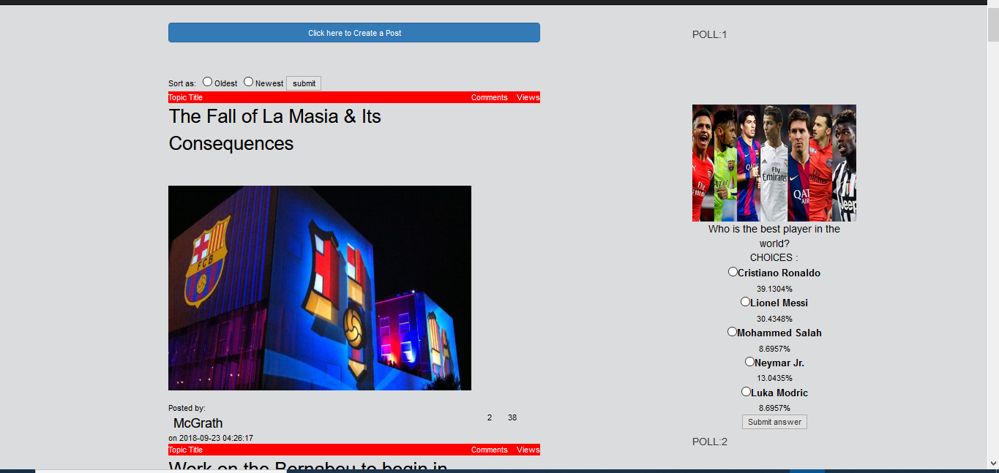

# Football-Buzz

## Table of contents

* [Introduction](#introduction)

* [Features](#features)

* [Technologies](#technologies)

* [Demo Screenshots](#demo-screenshots)

* [Setup](#setup)

## Introduction

This website is a blog site about football. Registered users can post articles, comment on them, vote on polls, etc. They can view all the posts, sort the posts, see their post's total comment, total views.

## Features

  * Registered users can post articles with an image and article title.
  
  * Registered users can also comment on any articles
  
  * Registered users can vote on any polls available on the site
  
  * Registered users can add a profile picture and update it anytime
  
  * Registered users can also update their profile information
  
  * Non-registered users can not post any articles or comment on them but they can view all of them
  
  * The articles are divided into different categories to make things easier for all users
  
  ## Technologies
  * Java
  * JavaFX
  * XAMPP
  * HTML
  * MySQL
  * Scene builder
  
  ## Demo Screenshots
  

 
 <h1>      </h1>

 

 

 
 
 <h1>      </h1>
 

 

 

 
 
 
 <h1>      </h1>

 

 

 
 
<h1>      </h1>
 

 

 
 
 
 
<h1>      </h1>
 

 

 
 
<h1>      </h1>
 

 

 

 
 <h1>      </h1>

 

 

 
 <h1>      </h1>

 

 

 ## Setup
 
'Medical_Assistant.java' file should be built at first using any Java supported IDE. During building if some libraries are missing then 
'MEDICAL ASSISTANT\APACHE LANG3 LIBRARY\commons-lang3-3.6\commons-lang3-3.6.jar' file should be imported. XAMPP server should be setup locally.Then using 'phpMyAdmin' a 
database named 'medical_assistant' should be created from there the 'REQUIRED SQL TABLE\medical_assistant (1).sql' file should be imported. Now the project is ready to run.
